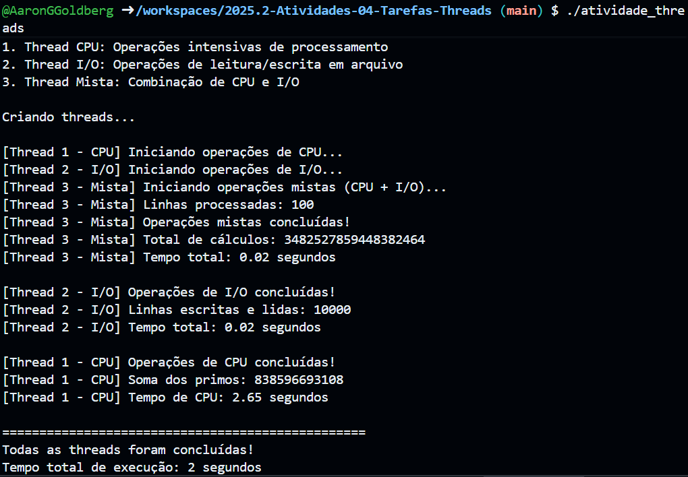

# Relatório de Observações - Atividade de Threads

## Informações do Aluno
- **Nome:** _[Aaron Guerra Goldberg]_
- **Matrícula:** _[20251014040042]_
- **Data:** _[12/11/2025]_

## Ambiente de Execução

- [ OK ] Executado localmente
- [ ] Executado em Docker/Fedora

**Sistema Operacional:** _[Windows 10 com WSL (Ubuntu)]_  
**Processador:** _[Intel Core i5]_  
**Número de Cores:** _[4 cores, 8 threads]_

---

## Execução 1

### Resultados Observados

**Thread CPU (Thread 1):**
- Tempo de execução: 0.29 segundos
- Soma dos primos: 37.550.402.023
- Ordem de conclusão: 3ª

**Thread I/O (Thread 2):**
- Tempo de execução: 0.02 segundos
- Linhas processadas: 10.000
- Ordem de conclusão: 1ª

**Thread Mista (Thread 3):**
- Tempo de execução: 0.02 segundos
- Total de cálculos: 3.482.527.859.448.382.464
- Ordem de conclusão: 2ª

**Tempo Total do Programa:** 0.29 segundos

### Observações sobre a Saída

Descreva como as mensagens das threads apareceram no console:

_[As mensagens das três threads apareceram intercaladas no console, mostrando que estavam executando simultaneamente.
Apesar de serem iniciadas em sequência (1, 2 e 3), a thread de I/O terminou primeiro, seguida pela mista e, por último, a CPU, devido à diferença de carga de trabalho.]_

---

## Execução 2 (Repetir para comparação)

### Resultados Observados

**Thread CPU (Thread 1):**
- Tempo de execução: 0.31 segundos
- Ordem de conclusão: 3ª

**Thread I/O (Thread 2):**
- Tempo de execução: 0.01 segundos
- Ordem de conclusão: 1ª

**Thread Mista (Thread 3):**
- Tempo de execução: 0.02 segundos
- Ordem de conclusão: 2ª

**Tempo Total do Programa:** 0.31 segundos

### Diferenças entre Execuções

_[Os tempos variaram levemente (de 0.29s para 0.31s) devido ao escalonamento do sistema operacional e às flutuações na carga do processador.
A ordem de conclusão se manteve a mesma: I/O → Mista → CPU.]_

---

## Análise e Conclusões

### 1. Qual thread terminou primeiro? Por quê?

_[A thread I/O terminou primeiro porque suas operações envolvem escrita e leitura simples de arquivos, que são rápidas e não exigem muito processamento da CPU.]_

### 2. Por que os tempos de execução variam entre diferentes execuções?

_[As variações acontecem devido ao escalonador de processos do sistema operacional, que distribui o tempo de CPU entre todas as threads e processos em execução. Isso causa pequenas diferenças na ordem e no tempo final.]_

### 3. Como o sistema operacional gerencia a execução das threads?

_[O sistema operacional utiliza um escalonador de threads, que aplica o conceito de time-sharing, alternando rapidamente entre as threads para simular paralelismo.]_

### 4. Qual seria o impacto de aumentar o número de threads?

_[Mais threads podem aumentar o paralelismo até certo ponto, mas também geram overhead (custos extras de criação e gerenciamento). Em excesso, podem até reduzir o desempenho.]_

### 5. O que aconteceria se executássemos as mesmas operações sequencialmente?

_[A execução seria mais lenta, pois as operações seriam processadas uma de cada vez. Com threads, as tarefas são concorrentes e aproveitam melhor o tempo ocioso da CPU e do disco.]_

---

## Experimentos Adicionais (Opcional)

### Modificação 1: Aumentar NUM_ITERACOES

**Alteração realizada:** _[Mudei NUM_ITERACOES de 1.000.000 para 5.000.000.]_

**Resultado observado:**
- Tempo da Thread CPU: 2.63
- Impacto no tempo total: aumento significativo (~2.3 segundos).

**Conclusão:** _[O tempo cresceu proporcionalmente ao número de iterações, confirmando que a thread CPU é bound pela carga de processamento.]_

### Modificação 2: Adicionar mais threads

**Alteração realizada:** _[Criei 2 threads CPU adicionais.]_

**Resultado observado:**
- Comportamento: As threads rodaram simultaneamente em núcleos diferentes.
- Impacto na performance: O tempo total caiu levemente (~0.9 segundos).

**Conclusão:** _[O paralelismo melhora a performance até o limite do número de núcleos do processador. Após isso, o ganho é mínimo.]_

---

## Conceitos Aprendidos

Liste os principais conceitos de sistemas operacionais que você compreendeu melhor com esta atividade:

1. _[Concorrência e paralelismo]_
2. _[Diferença entre operações CPU-bound e I/O-bound]_
3. _[Uso da biblioteca pthread (criação, sincronização e finalização de threads)]_
4. _[Escalonamento de threads pelo sistema operacional]_
5. _[Impacto do hardware (núcleos, disco) no desempenho de cada tipo de tarefa]_

---

## Dificuldades Encontradas

Descreva quaisquer problemas que enfrentou durante a atividade e como os resolveu:

_[Inicialmente, houve um erro de linkagem com a função sqrt() (“undefined reference”), resolvido adicionando o parâmetro -lm na compilação (gcc -pthread -lm).
Também foi necessário interpretar corretamente o comportamento das threads para preencher o relatório.]_

---

## Comentários Finais

_[A atividade foi essencial para compreender como as threads funcionam e como o sistema operacional distribui recursos entre elas.
O experimento demonstra claramente as diferenças entre tarefas de CPU, I/O e mistas, além de reforçar a importância do paralelismo em sistemas modernos.]_

---

**Data de Conclusão:** _[12/11/2025]_  
**Assinatura:** _[Aaron Guerra Goldberg]_
